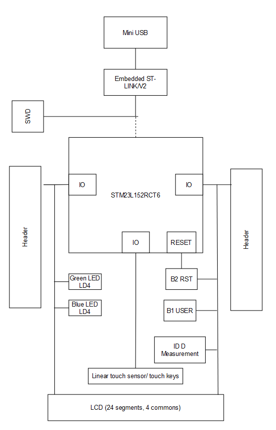
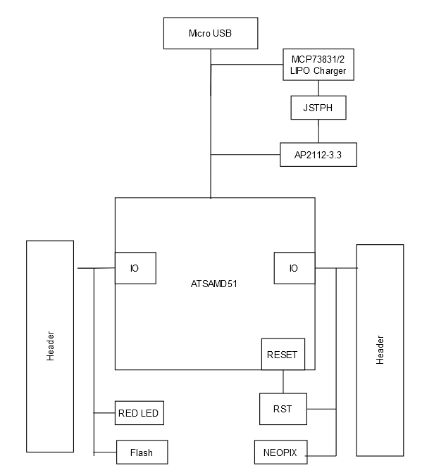

Making Embedded Systems
Week2 Assignment

Question|STM32L152C-DISCO|Adafruit Feather M4 Express
---|---|---
What kind of processor is it? | STM32L152RC ARM® Cortex®-M3 | ATSAMD51 32-bit Cortex M4
How much Flash and RAM does it have? Any other memory types? | 256 Kbytes of flash memory, 32 Kbytes of RAM, and 8 Kbytes of data EEPROM | 512KB Flash and 192KB RAM
Does it have any special peripherals? (List 3-5 that you find interesting) | a 24‑segment 4‑common LCD, LEDs,push-buttons, a linear touch sensor, and touchkeys | Built in 100mA lipoly charger with charging status indicator LED, 6 x hardware SERCOM - Native hardware SPI, I2C and Serial all available, 16 x PWM outputs - for servos, LEDs, etc
If it has an ADC, what are the features? | 12-bit ADC 1 Msps up to 40 channels | Dual 1 MSPS 12 bit ADC (6 analog pins some on ADC1 and some on ADC2)
How much does the board cost vs what the processor costs? Is the processor in stock anywhere? (Try Digikey, Mouser, Octopart, Google, and so on) | Board: $13.30 (Digikey), Processor: $9.47 (Digikey) | Board: $22.95 (Adafruit), Processor: $5.54 (microchip.com)

### STM32L152C-DISCO - Hardware Block Diagram

### Adafruit Feather M4 Express - Hardware Block Diagram
